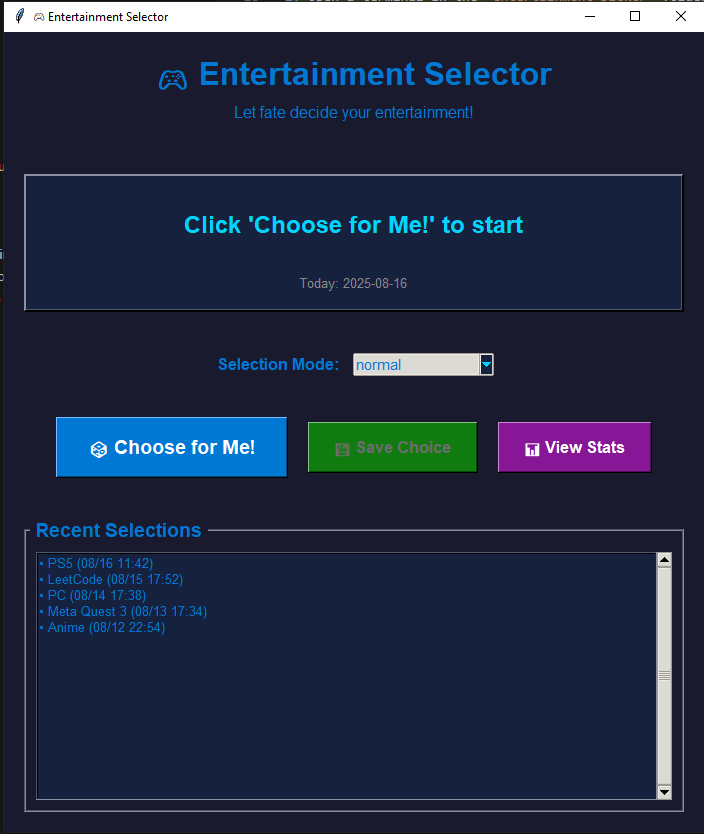

# Entertainment Picker

A simple Tkinter-based desktop app to help you decide what to do for entertainment! Randomly pick from your favorite activities, save your choices, and view your selection history and stats.

## Features
- 🎲 Randomly select an entertainment option (PC, PS5, Book, etc.)
- 💾 Save your daily choices to a local SQLite database
- 📊 View recent selection history and stats
- Multiple selection modes: normal, variety boost, avoid recent
- Modern, colorful UI

## Requirements
- Python 3.7+
- Tkinter (usually included with Python)

## How to Run
1. Make sure you have Python installed.
2. Open a terminal in the `entertainment_picker` folder.
3. Run:
   ```sh
   python main.py
   ```

## File Structure
- `main.py` - Main application code
- `entertainment_app.db` - SQLite database (auto-created)

## Screenshot



## Disclaimer
This code was written vibe coding style with support from AI

## Selection Modes Explained

The app supports three different sampling logics for picking your entertainment option:

- **Normal**: Standard weighted random selection based on your preset weights for each activity. No special logic is applied.
- **Variety Boost**: Activities that have been picked less often in recent days are more likely to be chosen. This helps you try new things and avoid repeating the same activity too often.
- **Avoid Recent**: Activities that were picked in the last 7 days are much less likely to be chosen (but not impossible). This mode encourages you to rotate through your options and avoid repeats.

You can select the mode from the dropdown in the app before making your pick.